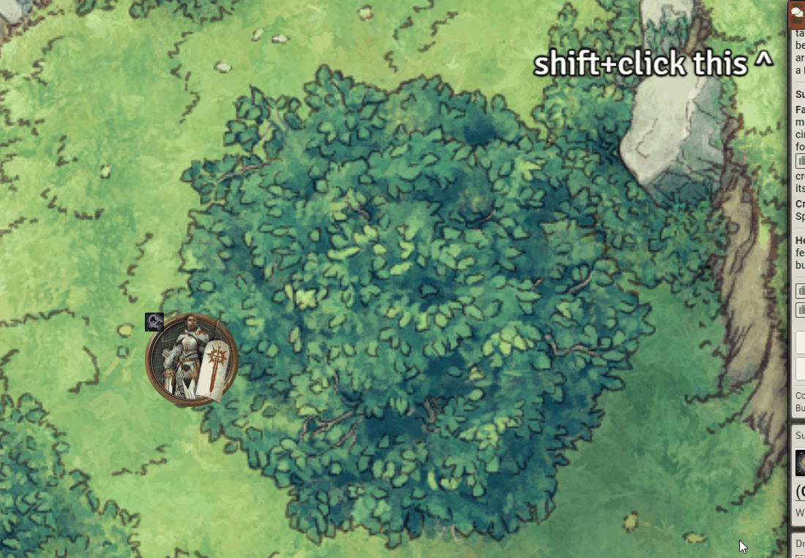

# [pf2E Extempore Effects](https://foundryvtt.com/packages/pf2e-extempore-effects/)

FoundryVTT module for the PF2e system, which allows creating temporary Effects from chat messages, to easily mark tokens
as affected by a spell/action/item that doesn't normally have embedded effects.

To install, browse for it in the module browser,
or [directly copy the manifest link for the latest release](https://github.com/shemetz/pf2e-extempore-effects/releases/latest/download/module.json)
.

# Features

### Message right-click context menu option, "Extempore Effect", to convert a message into an effect
To use, select one or more tokens and then right-click on a message in the chat. An option, "Extempore Effect", should
appear. Clicking that option will grant a new Effect to all controlled tokens.

The Effect will have its name, description, level, traits, etc. match the message's item ("item" here being a spell,
an action, a feat, a weapon, etc.). The duration will usually fit if possible (required some hardcoding and doesn't
cover all bases).

The image will fit the item too, but not if it's a "default image" (like the default feat icon or
any of the simple 1/2/3-action icons). To avoid having several Effects with the same image (and avoid the boring
default images), this module will either use the image of the original item's token/actor, or will randomly pick a
simple colored image.

As a bonus feature, right-clicking actual Effect messages will display an "Apply Effect" option to just apply that same
effect to the controlled token. This is just a quality-of-life feature.

### Shift+clicking the "Extempore Effect" option, to also open the effect's sheet
If you hold the Shift button, the effect's sheet will be opened up for you to see and edit, after being applied.
You can configure to use Ctrl instead of Shift, or to disable this behavior, in the module settings.

This is useful if you want to quickly edit the effect - for example:

- Rename Mirror Image to "Effect: Mirror Image **(3)**" **(note:  less needed now that we have core Counter support)**
- Rename Mummy Rot to "Effect: Mummy Rot **(stage 1)**" **(note:  less needed now that we have core Counter support)**
- Change Steal Shadow's duration from Unlimited to 2 hours.
- Change Arsenic's image from the picture of a powder to a picture of deadly poison.

### Shift+clicking an effect in the effects panel, to edit it
You can shift+click an existing effect icon in the panel that appears in the top right corner of the screen, when
controlling a token.  This will open the sheet of that effect/condition, allowing you to read it and edit it.  Useful if
you want to get a refresher about its rules, or to edit a small detail about it.

### Ctrl+Shift+E (editable) keybinding, to create an empty effect
This new keybinding, "Quick create empty effect", will do something similar to the Extempore Effect except with fully
empty contents (not based on any message), also immediately opening the sheet for you to edit.  The name will be
untitled and the image will be a random icon (the randomness depends on screen position, so if you don't pan or zoom
around you can keep creating random effects with the same icon, which is sometimes handy).

### "Hidden from player" toggle for effects
This feature was removed from the module, because now it's [part of the core system](https://github.com/foundryvtt/pf2e/pull/4608) :]

(migration will happen for any users who relied on this module until now)

# Demos

(These gifs are slightly outdated;  the option name changed from "Cause an Effect" to "Extempore Effect", and conditions
no longer tick up-and-down on click.)

### Extempore Effects

### Shift+clicking

